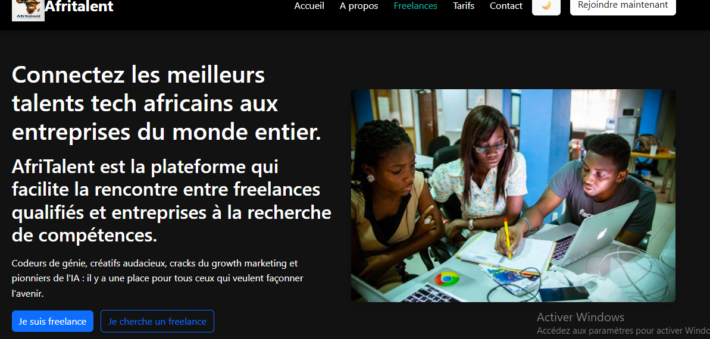

# AfriTalent 
AfriTalent

## Description

AfriTalent est une plateforme web qui met en relation les freelances africains et les clients à la recherche de compétences professionnelles.

Le site permet de découvrir des profils de freelances, consulter leurs compétences et faciliter la mise en contact avec des clients potentiels.

## Objectifs

- Valoriser les talents africains.
- Faciliter la recherche de missions freelance.
- Offrir une plateforme moderne et responsive.

## Public cible

- Freelances
- Entrepreneurs
- Startups
- Entreprises

## Technologies utilisées

- HTML 
- CSS
- Bootstrap 5
- JavaScript
- Git & GitHub

## Fonctionnalités

- Barre de navigation responsive
- Section Hero
- Présentation des services
- Profils de freelances
- Formulaire de contact
- Design responsive (mobile, tablette, ordinateur)

## Captures d'écran

## Lien du site

https://samba-dia.github.io/Dia-Sanba-Afritalent/

## Présentation powerpoint
Le fichier de présentation est disponible dans le dossier 'docs'.